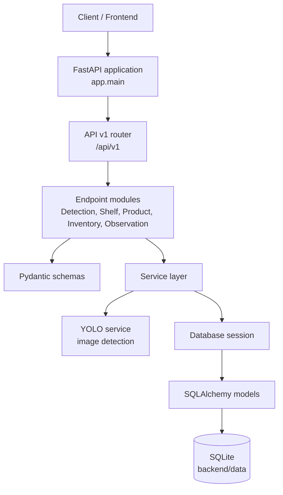

# Smart-Shelf

Smart-Shelf is a smart inventory management project that combines a FastAPI backend, a SQLite database, and computer vision tools for shelf and product detection.

## Project Structure

- `backend/`: FastAPI application, SQLAlchemy models, database setup, and image processing services.
- `folder_structure.md`: Detailed project tree.

## Architecture



The API endpoints validate request and response data through `schemas/`, delegate business logic to `services/`, and use SQLAlchemy models through the database session. Detection requests additionally use the YOLO service for image processing.

## Backend Setup

Install the dependencies from the project root:

```powershell
python -m pip install -r backend/requirements.txt
```

Initialize the local database:

```powershell
cd backend
python create_db.py
```

Start the API from the `backend` directory:

```powershell
uvicorn app.main:app --reload
```

The API runs at `http://localhost:8000`. Interactive documentation is available at `/docs`.
